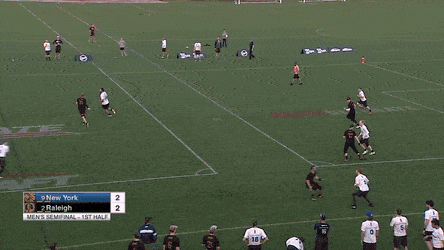

# Breaking the Mark (Isaac Saul)

# Week 1 - Break an Extended Mark

In my upcoming Ultimate Skills Project module, I’m going to share the drills and best practices I’ve learned from a lifetime of being around ultimate and watching the world’s best players. We’ll talk about ways to develop great break throws with a partner and go over film you can study of the sport’s best break throwers. I’ll do my best to mix in ways you can improve your team’s break throwing and touch on the “chess match” aspect of being a dominant break thrower.

 

To begin, let’s start with the “extended mark” break mark drill. 

 

<iframe src="https://www.youtube.com/embed/9nfo_lLKcbk?controls=0" width="560" height="315" frameborder="0" allowfullscreen="allowfullscreen" style="box-sizing: border-box; position: absolute; top: 0px; bottom: 0px; left: 0px; width: 640px; height: 360px; border: 0px; background-color: rgb(0, 0, 0);"></iframe>

**What you’ll need:** 1-2 partners and as many discs as possible.

 

**Set up:** Give 1 partner two discs to hold in their hands to “extend” their mark by a foot on each side. Get a second partner or target set up behind them.

 

**Action:** Go through all the forces you might face in a game: flick, backhand and straight up. Position your target on the break side and try to consistently break the mark. Have the mark stall you starting at “Stall 4.” Force yourself to not throw until you have pivoted at least twice (this drill will be tiring!)

 

**Goal:** Get point blocked. Yes, the goal here is to find your limits. If you are breaking the mark over and over you are not doing what you should be. You should test your limits early and then get into a rhythm where you are breaking the mark consistently but getting point blocked occasionally because you are trying throws you don’t have—that’s what practice is for!

 

**A note on breaking an extended mark:** It won’t be easy. You’ll be surprised how much more difficult it is when your mark has 2 extra feet of mark to block you. One of the ways it will be more difficult is that your mark will be able to cover more ground without leaning or moving as much, and that means you need to do more to move them around and fool them.

 

The best way to break an extended mark is to use a high variance of throws and pump fakes. Throwing wise, that means you should experiment by changing release points, throwing off of pivots, throwing from standing still, breaking the mark early and breaking the mark late in a stall count. Faking wise, you should think the same thing: variance. Throw big pump fakes and little pump fakes. Use your pivot foot and throw flat-footed. Use shoulder shimmies and head fakes. The less often you repeat moves, release points or patterns the more difficult it will be for your defender to point block you. Good luck!

 

**Homework:** You and 1-2 partners will perform the extended break mark drill. If you don't have a partner receiving the throws, set up with a target like a lacrosse goal or trash can. Each thrower will get 50 throws at a time. You get 1 point for completing 5 throws in a row. Each partner will do 4 sets of 50 throws for a total of 200 reps. Make sure to take time to rest and drink water between sets- this should be intense and tiring!

**You can't throw the exact same throw twice in a row!** So, if you throw 2 backhands in a row, they need to be differently shaped throws or different release points.

Post your points total in the [Isaac Saul Topic in the Community](https://www.ultyresults.com/products/community/community/feed?topic_id=13148)!

# Week 2 - Throwing Off Balance

One of the keys to being an effective break thrower is being able to throw off-balance. That means throwing with only one foot on the ground, throwing while you’re being fouled, throwing while you are leaning over, throwing when you’re uncomfortable. Get together as many Frisbees as you can and just practice releasing from weird balances. Go through every iteration: stepping back to around flicks but throwing before your non-pivot foot comes down. Stepping into inside backhands but throwing as you fall over. Throwing around backhands without pivoting. Throwing around forehands where you step so far out you nearly lose your balance (or do!). Find the limits of your range. If you have a partner, have them foul you, gently push you, violate your disc space or hack your arms as you throw. Great break throwers can complete passes when they are off-balance or being fouled.

 

<iframe src="https://www.youtube.com/embed/NDcJfehNTrE?controls=0" width="560" height="315" frameborder="0" allowfullscreen="allowfullscreen" style="box-sizing: border-box; position: absolute; top: 0px; bottom: 0px; left: 0px; width: 640px; height: 360px; border: 0px; background-color: rgb(0, 0, 0);"></iframe>

 

 

**What you’ll need:** 0-2 partners and as many discs as possible.

 

**Set up:** Set up a thrower, mark and receiver or target if you have it. 

 

**Action:** Go through all the forces you might face in a game: flick, backhand and straight up. Position your target on the break side. Practice pivoting and throwing to the target, but work on releasing when you are off-balance. A good way to think about off-balance throwing is throwing before your non-pivot foot hits the ground. You can also throw you extend yourself, or reach for such a low release point, that you end up on the ground. 

 

**Goal:** Break the mark or hit your target consistently while throwing from uncomfortable positions. Often times, as a thrower against a good mark, lanes open up while you’re stepping through or around your mark. This is a great way to practice those throws when your off-balance and see how accurately you can release a disc from uncomfortable positions. 

 

**Scoring:** Every time you complete a pass or hit your target, it’s a point. Every time you miss the target or throw an incompletion, you lose a point. Work in high-intensity reps until you reach 10 points, then take breaks. 

 

**A note on throwing off-balance:** 

 

It won’t be easy. Embrace the challenge of releasing from really uncomfortable positions. Be okay falling down. Ask your mark, if you have one, to intentionally foul you (not hard enough to be dangerous, but enough to impact your throws). Working through aggressive marks and timing releases from positions where you aren’t comfortable is really critical. If you can complete passes consistently in this drill, you’ll have no trouble throwing them in games. 

# Week 3 - Film Study!

One of the best ways to learn to throw like a great break mark thrower is to watch how a great break mark thrower plays in important games.

 

I found two awesome examples of high-level break throwers playing at the peak of their game. In the open division, you can [watch Sean Keegan](https://youtu.be/coQl9xza3HQ?t=590) (#2 on PoNY in white, long black pants with gloves, first point at 9:59). In the women’s division, you can [watch Alex Snyder](https://youtu.be/qGW54EFGDIg?t=68) (#4 blue, wearing black frontwards hat). 

 

While Keegan and Snyder have different styles of throwing, they both have similar characteristics that make them great break throwers. They’re aggressive and confident throwing to the break side. In their progressions looking downfield, each of them look to the break side early in the stall count because they know there are dangerous places to throw on the field in that direction. Both are comfortable throwing around and through their marks, often from uncomfortable or off-balanced positions as throwers. Each anticipates their cutters making moves to the break side and are willing to throw in that direction early on in a cutter’s progression. 

 

For your exercise in this module, watch either full game of Keegan or Snyder. Pay close attention to a few things:

 

- **Whether they fake** before they throw breaks, and ***how\* they fake**
- **What areas of the field** they throw breaks to and which areas they look off
- What happens **after** their break mark throw is completed
- What kind of **variance** in break throws they use

 

 

Alex Synder uses some quick inside break throws to set up a Fury huck for the score.

 

The goal here is to recognize how great throwers consistently break the mark: by faking, changing their release points, throwing to advantageous spots on the field, etc. It’s also to fully understand how important breaking the mark is to an efficient offense. Often times, Keegan and Snyder will open up more consecutive, yardage-gaining passes downfield by breaking the mark. Pay attention not just to how they break the mark, but to where the disc moves after they break the mark. You’ll find that both Keegan and Snyder’s throws often lead to yardage-gaining passes. You should also notice that when Keegan and Snyder are in a groove and breaking the mark often, their team’s offense tends to flow and score. When their break shots are stifled, things get tougher. 

Sean Keegan throws 2 break throws that allow the rest of the PoNY offense to work the disc down the open side, resulting in a goal.

 

Give either game a watch and then hit the comments with what kinds of stuff you saw and what you noticed about their throwing abilities. Try to make at least one note on each of the bullet points listed above!

# Week 4 - Practice the Cheeky Stuff!

Along with being able to break big marks and throw off-balance, great throwers tend to have another shared quality: an arsenal of unorthodox, emergency-situation throws that they can hit with consistency. A few years ago, the lefty backhand qualified as such a throw. In today’s game, it’s a lot more common. But along with off-hand throws, there are the over the top throws, blades, scoobers, push passes, throwing through an opponent’s legs (yes, once in a blue moon you might need it), and as Jonathan Nethercutt demonstrated in an AUDL game, even behind the back flicks. For this module, you’ll want to spend a couple hours practicing all of these crazy, unusual, emergency throws. **Remember: these throws should never be options a, b, or c.** But they are worth having when you’re really in a jam, and they’ll undoubtedly pay off in a big moment. 

 

**What you’ll need:** 0-2 partners and as many discs as possible.

 

**Set up:** Set up a thrower, mark and receiver or target if you have it. Tell your mark you’ll be throwing nothing but “crazy” throws. 

 

**Action:** This is the final stage of being a great break thrower. With two partners (one receiver and one mark), commit to practicing unorthodox throws to the break side. Practice scoobers, blades, and outside in forehands (against a force flick mark) to the break side. Also, get lots off reps throwing off-hand backhands and no-pivot around backhand throws. This way, they know what to expect and will make your life a little more difficult. While none of these throws should ever be your primary option they are good to have in the arsenal. 

 

<iframe src="https://www.youtube.com/embed/vuASiJ0s2Nk" width="560" height="315" frameborder="0" allowfullscreen="allowfullscreen" style="box-sizing: border-box; position: absolute; top: 0px; bottom: 0px; left: 0px; width: 640px; height: 360px; border: 0px; background-color: rgb(0, 0, 0);"></iframe>

 

**Goal:** Find 1-2 throws that you don’t normally throw and get comfortable with them. Break the mark as best you can and be okay with turning the disc or getting point blocked. Focus on improving your shooting percentage throughout the drill. 

 

**Scoring:** Every time you complete a pass or hit your target, it’s a point. Every time you miss the target or throw an incompletion, you lose a point. Break into 10 sets of 10 throws, and aim to complete more passes in the second half of the sets than the first half

 

**A note on throwing the tricky stuff:**

 

Use your first 10-15 throws to go through every weird throw you can think of, and then pick 2-3 that you feel like you can master and go with them. My personal favorites are scoobers, lefty backhands, and overhead forehand blades, but those throws are all becoming more and more common in the game today. Maybe you can be the thrower to master off-hand around flicks?