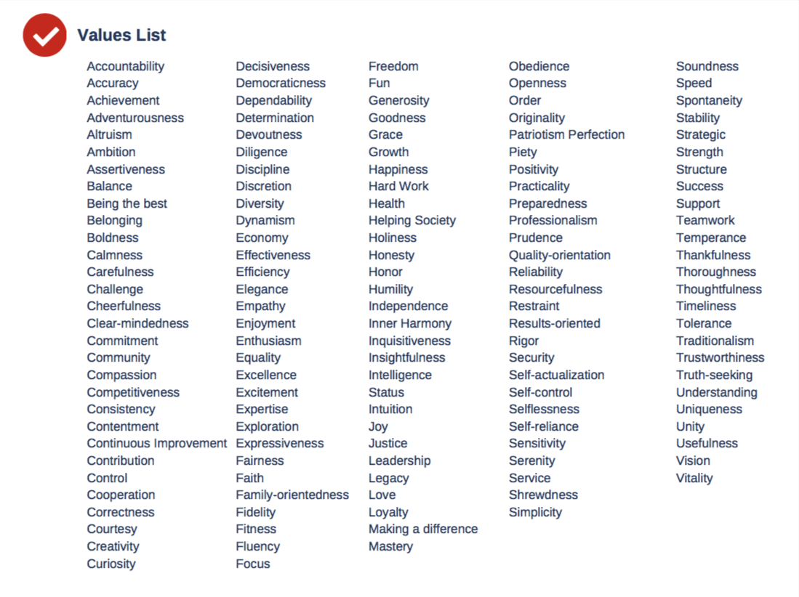
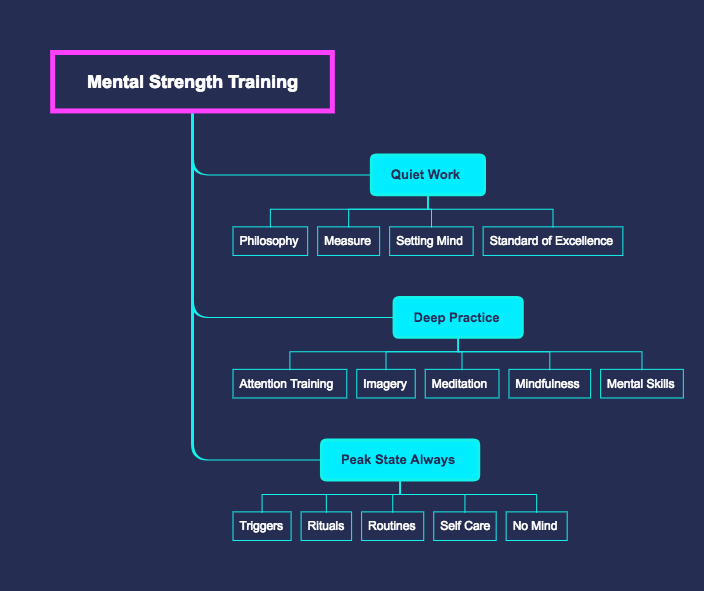

# Laying the Foundation of Mental Strength Training (Anna Rogacki)

# week 1 - Define Your Athletic Values

Have you followed a Mental Strength Training Program before? Do you feel like you have the talent and physical ability but that a lack of confidence holds you back from your best performance? Have you ever felt things you’re not proud of like jealousy over playing time, choking under pressure, or anger at teammates who need your support? All of these are normal things in the life of an athlete, but in order to reach our full potential, we need to train our mind to focus on the things that will help us to perform in the moment and to ignore distractions and deal with emotions that are not helpful.

##  Begin at the Beginning

The program I am planning for you will lay the foundation of mental strength training. You will learn about the Quiet Work that anyone wanting to perform at peak/to their full potential needs to do. Ask questions that gather crucial information about what is important to you, learn how to set your own standard of excellence, discover how to train more effectively.

To get the juices flowing I will leave you with these 2 exercises.

##  Your Top Five Athletic Values

Your top 5 Athletic Values. What are they? I have attached a list of values for you to look over. First go through and mark down any values that stand out for you. Don't think about narrowing down yet. Then when you have that list - think about what it means to you to coach or play Ultimate. What - on a very personal level - is important to you. Once you have your top 5 let's hear them!!

It is always an interesting exercise to see your teammates'/players values. Conflict often arises from a simple difference in values. If you know what is really deeply important to your teammate it can help you understand where they are coming from, decreasing tension and conflict - increasing compassion... a crucial mental skill for team culture!!!!

 

## Character Strength Survey

When you have completed the top 5 Values exercise I have a Character Strength Survey for you. This isn't strictly part of the module. More just a fun add on in the journey of knowing yourself. My approach to Mental Strength Training is STRENGTH training. By creating awareness around key mental skills we are able to train and become stronger. We are not broken - we are building. Have a go!

"The VIA Survey of Character Strengths is a simple self-assessment that takes less than 15 minutes and provides a wealth of information to help you understand your core characteristics. Most personality tests focus on negative and neutral traits, but the VIA Survey focuses on your best qualities." http://www.viacharacter.org/www/Character-Strengths-Survey

Are you game??

 

## Your Homework

Post your Top Five Athletic Values in the comments. There are no wrong answers, just authentic answers!

# week 2 - Your 25 Word Philosophy

**Philosophy** -  a theory or attitude that acts as a guiding principle for behavior.

Let's think about this for a moment - a theory or *attitude* that acts as a *guiding principle for behavior*.

What currently guides your behavior? Is it external factors outside of your control eg: happy and playing well when you are winning/paralyzed by pressure or fearful when the game is on the line? Is it whatever mood you wake up in? Is it the people around you?

What if you had an internal guide - a guide that wasn't susceptible to uncontrollable external influences? A guide that remained steady and provided clarity for you to plan out your own path. How would this make a difference to how you approach your season?

When the quiet work is done we are able to get very clear on what is important to us. We know why we are doing the extra sprint set, the extra throwing sets. We know why our attitude is important and how it affects others. We are able to map out what we want from a campaign instead of being at the mercy of what a campaign provides (or doesn't provide). We are in charge of taking ourselves to the next level.

Your philosophy. Let me be clear. This is a work in progress. It changes, it evolves, it stretches with you. But you need to start with something. Start with this question. Who am I? Ponder that and see what pops up. Here are some others to get you going....

What do I stand for?

What is important to me?

What does success look like to me?

**Quiet Work** - Spend some time pondering and writing down your answers to these questions. Do you have any questions to add? See if you can come up with a philosophy of 25 words or less. This 25 or less concept comes for Coach Pete Carroll's book. Win Forever. A big advocate for having a philosophy. A great read too!

Having a philosophy aligns your thoughts, your words and your actions. Every great leader, athlete or regular person doing big things in their own life knows who they are, what they stand for and how they will go about performing at peak. Based on your values and the answers to these questions - what is your philosophy??

## Homework:

Develop a working philosophy and post it below. See if you can keep it to 25 words or fewer!

# week 3 - Choose Your Mindset

Now that you have created awareness around your values and your personal philosophy it is time for your to set your mind.

Your mindset determines how you filter or experience the world around you. It also determines how the world around you experiences you. It you have a negative and critical mindset then that is what you will focus on and the lens you will view events through. It is also the experience that the people around you will have of you. The same if you chose a positive mindset.

Believe me when I say, this is breaking news for many people. You get to choose your mind set. You can set your own mind. So often I am met with language like - "I can't help the way I feel" or "That's just the way things are". In terms of Mental Strength we are training our ability to choose our response. And the way we do that is we set our mind based on our values, our philosophy and how we want to experience our world. We also set our mind based on who we want to be and become.

Do you want to have an open, curious and non - judgemental mindset? Do you want to have a risk adverse, cautious and reserved mindset? Do you want a competitive mindset? Disciplined and determined? The main point here is that you get to choose. You then get to pursue your vision of how you want to behave, you have a set of clear guidelines (including your values and philosophy) that determine how you think, feel and behave and perhaps most importantly how you respond.  When we have this we have clarity, consistency and we have confidence. Confidence in our ability, no matter the external circumstances, to be able to choose our response.

**Quiet work** - choose to set your mind. This year how do you what to view or experience the world. How do you want those around you to experience you? As with a lot of this work there is no right or wrong! It is simply your choice based on what is important to you.

When you have decided on your mindset - how you want to approach your next athletic pursuit - can you think of a few examples of real life scenarios where the mindset you have chosen will serve you? What would your actions be? What would your thoughts and feelings be?

## Homework

Write a few words or a phrase describing your chosen mindset for the upcoming season.

# week 4 - Your Future Self

**Where is your opportunity for growth?** Based on what is deeply important to you - Who do you want to be? You know who you are now (values, philosophy) so, who do you want to become. What will your evolution be?

Defining your future self is not goal setting. Envisioning your future self is about defining the person you need to become in order to get what you want. The goal setting builds from this foundation. If we think about it from a season/campaign scenario. In order to be the player you want to be by the end of that season, what do you need to do? **How will you measure it?** For example: my future self is unflappable, consistent and can thrive in chaos. OR my future self is aware of others needs and seeks to support teammates always.  Can you see how this is different to setting goals? However, like effective goal setting we need to put in place the ability to measure and track.

### Measure

If your future self is about being unflappable, consistent and resilient how can we measure it? Ask yourself - **what will my behaviors/actions and thoughts look like** when I am unflappable and consistent? **What will it feel like when I am resilient? What will I tell myself?**

### Tracking

When we have a clear picture of what your future self looks like, sounds like and feels like, we decide what we will do to get there and we track the progress. For example if I want to be consistent and unflappable I would practice mindfulness, attention training and mental imagery. If my future self was going to be fit and strong I would practice nutrition and physical conditioning. **How many times a week will I do this? How will I track it, electronically or with a calendar?**

## Homework!

Your future self - who is it?

Work through each paragraph above. Answer the questions (in bold). Formulate, based on who you are now and what is important to you, how you are going to go about executing it. Being to becoming.