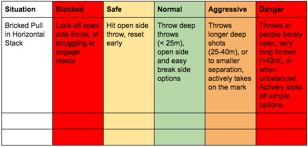

# Decision Making in Ultimate (Sion "Brummie" Scone)

# How to Improve Your Decision Making

# Setting the Scene

This course is largely about decision making for throwers, but you can apply the same concepts against other aspects of your game too.  This course is not about improving your throws, just about making better decisions with the throw you have. Of course, as your skills improve, so your decisions will need to change to reflect your skill base.

## Goal Setting

- What are you trying to achieve?

- - “Improve my decision making” is a really bad objective because it is so vague.
  - What scenarios do you make good and bad decisions?
  - What options would you like to make instead?

- How will you measure it?

- - Increased self-awareness
  - Input from team mates

### Judging Success

Try to avoid judging success in decision making based on whether your throw was completed or not.  If you throw a perfectly weighted leading pass that is inexplicably dropped by a normally reliable receiver, that is not your fault and certainly not a bad decision. Likewise, if you throw a blade into a crowd that is blocked, hangs in the wind and is caught, this doesn’t make it a good decision either.

## The Decision Making Process

Ask yourself: “can I reliably connect on this throw?”  If the answer is no, then don’t even consider it. If you say yes, that doesn’t mean you should always throw it!  These types of internal calculations are what decision making is all about. Consider each throw on a risk vs reward chart; an example below:

There is an exception, and that is when your objective is to improve your skills.  In that situation, you would want to take on throws that you might not feel entirely comfortable with.

# Week 1: Increasing Self-Awareness

## Week 1

### Prep Homework 1: Establishing a baseline via Game Analysis

Objective: play a game as you normally would.  In order to establish an accurate baseline, it is really important that you play in your normal style.  If you approach the game trying to be “extra cautious” then the process won’t work, so just relax and play ultimate in your own natural style :)

After (or preferably, during) the game you’ll want to review any decisions that you felt were particularly “bad”.  But what do we mean by “bad decision”?

#### Defining Good or Bad:

- This is for you to decide; I will not define what counts as good or bad for you or your team

- Only you can be the judge; however, if you can find a consistent third party then you might find it useful to get their perspective as an external viewpoint

- - A team mate is a good person to do this (*must* be the same one each time!)
  - Try to get an additional viewpoint instead of relying on your regular coach; you’re always getting their feedback, so a fresh pair of eyes will add a different perspective
  - Preferably, talk to multiple team mates; the more input, the better
  - It might be worth talking to your captain or other leaders to find out what role they envision you playing, and use that to guide your definitions.  Particularly useful if you are seeking to win a role within a team or to get more pitch time.
  - If you can, why not film a game?  Or, you can use a recently filmed game of you if you happen to have one available.

- What counts as “good” or “bad” can vary based on your team and your role within it.  If you are a leading player on your student team and also play club ultimate but have a smaller role, for instance, then you should ensure that you use the same practice and context for comparison in this exercise, and be aware that punting a 50/50 throw might be a good decision for you to do at a student warm up event, but a terrible decision when trying out for a club

- If you are a younger player on a team, you’re more likely to want to minimise risk at the expense of not taking on more difficult throws; for a senior player, this might be reversed

- You need to think about your team’s style when making these judgments. If your team plays a high tempo offence, then looking off any short pass might hurt your team, so this might class as a “bad” decision.  Likewise, throwing the first available throw might be the good decision, while sitting on the disc, even for a few seconds, to look for a “better option”, might actually be a bad decision. If your team plays a slower, isolated based offence, then this scenario might be reversed.

- For each scenario, visualise yourself in a game scenario.  What actions do you want to take? Repeat this process a few times and you’ll be able to use it to remind you of what your actions should be when you find yourself in that situation for real.

### In-game Homework, Week 1

You will need:

- Something to make notes (pen & paper / phone)

During a game:

- take note of the  “good” and “bad” decisions that you make. Jot down the game context too; “sideline trap on the backhand side” gives you a better understanding than “trapped”.  This is your Decisions Grid.
- While playing, try to avoid being conscious of making “good” or “bad” decisions.  We’re just trying to establish a baseline, so just play naturally and leave the assessment for later.  The data capture is the most important thing.
- The game can be a competitive match, or it can be a scrimmage at practice.  Just try to make it consistent across all weeks. In my opinion, practice games are best because the level of competition is most likely to be the same, but competitive games are fine.

So, for example, let’s say that you got to a high stall and you engaged with your reset, faked at them when they weren’t free, and dictated that they attack some new ground rather than panicking and looking to huck downfield.  You should jot this down in the “Good Decision” column.

After the game:

- Define what counts as “good” or “bad” for you
- Avoid doing this before you establish your baseline; you will simply bias your baseline
- Be as detailed as you want; you might only focus on the mistakes you made, but make sure to recognise when you did things well too.  Ask a team mate for their thoughts if you’re unsure

Examples:

**I cannot stress enough that for many players, these examples are flat out wrong!  So please don’t copy them. Make your own :)**

**The aim of the first round of homework is to work out what decisions count as “good” or “bad”, define what good looks like, and create a list of alternative actions that you could/should have taken instead.  Here’s an example:**

****

# Week 2 - Your Decision Grid

### Prep Homework 2: Game Review

- What were the game scenarios most associated with “bad decisions” from your list?

- What are the game contexts?

- - Sideline trap
  - Stall 5+
  - Bricked pull
  - While playing as a reset, etc
  - If there are lots, try to focus on just 3-5

- Memorise the good decisions.  Whenever you’re in a game situation and you take on one of these good decisions, give yourself a pat on the back!  You did the right thing. Keep track of the number of times you do this; a simple tally is the easiest way to do this, and you can even track your numbers week by week.  

- For each bad decision in your list, create a new action that you could have taken instead.  I’ve completed an example below, but I again must stress that these are examples and you need to create your own.  

- Be sure to identify the situation you were in as well, as this will be your mental cue for improvement.

- Decisions are not simply “throw or not throw”; the following actions can help:

- - Fake or pivot to release pressure and move defenders
  - Talking to team mates to encourage different cuts, which will provide different throwing options
  - Checking that you are balanced before releasing the disc
  - Calling fouls or contact against an aggressive marker, rather than being intimidated and allowing pressure to increase

- Again, revisit the visualisation exercise.  Recall one or more situations where you made a bad decision, but instead visualise yourself making a better decision.  Make sure you focus on the decision, not on the execution; if you threw a forehand huck in a trap situation which hung too long and was blocked, it is important that you visualise not throwing that option, but instead taking on another throw, rather than visualising throwing the perfect huck.

### Sample Decisions Grid

### In-Game Homework 2

- Repeat the same game analysis exercise

- The first step is to recognise each time you find yourself in one of the situations listed above.  Simply recognising that you are in a situation where you have a tendency to make poor decisions is an important step.

- Now compare the results against week 1.  

- - Did you make better/worse decisions in the situations you’ve identified?
  - Did you make worse decisions in other situations?  It’s possible that additional focus on one area of your game had an adverse impact elsewhere, but more likely that you have already started to apply that level of decisive thinking to all aspects of your game

- If you got input from one or more teammates previously, be sure to get their input too. Just remember that a good decision for **you** might be a bad decision for them, so make sure they are using your normal play as a baseline, not their own

You can now start to create a new Decisions Grid; you might find that you made some poor decisions in the second game in different situations than you did in the first game.  Simply complete the same exercises again, for as many weeks as you feel necessary. Over time, you will need to redefine what “good” and “bad” decisions are, because your skill level will improve and throws that were previously “bad decisions” are now run-of-the-mill!

# Week 3 - Becoming More Adaptable and Accountable

## Setting the Scene

Part of decision making is learning how to tweak your decision making for specific circumstances.  Would you take on the same options playing pick up as you might do playing a tournament final? Maybe… maybe not.  With this second method, we will work on the ability to tweak your decision making skill. This can be extremely valuable if you find yourself playing badly and need to rebuild confidence by taking on some smaller, easier options, i.e. playing safer than usual.  Likewise, when you are trying to improve on specific areas of your game, you can be more aggressive, taking on throws that you’re not 100% comfortable with yet. The aim of this next section of the programme is to be able to switch seamlessly between these different modes of operation, and for you to be able to play “safe”, “aggressive” or “normal” in any given point.

### Why?

- A player that never takes risks or pushes their limits will never improve
- A player that constantly takes too many risks will be a liability and reinforce poor decisions making
- We seek to find a balance; playing expansively in such a way that we can improve our skill level

### Setting Expectations:

- We are looking for tweaks on your current behaviour, not wild swings, or erratic behaviour.  You won’t learn anything if you throw in an uncontrolled way as soon as you get the disc, neither will you learn by never taking on any throw other than a 2m backwards reset
- Bear in mind what your role on the team is when setting expectations.  What is a realistic goal for a short term program of behavioural change?  

## Week 3

### Prep Homework 3: Defining Levels of Aggression

- Roughly define different styles of decision making, i.e. what counts as safe, aggressive or “normal” for you

- Try to imagine all of the possible throws available within a stall count for one situation, and assign each option into one of the categories.  Note that timing is a key factor in decision making; throwing a huck when the receiver is close to the disc and has large separation is going to be a higher percentage option than a few seconds later when they are further away and when the defender might have closed the gap

- Be mindful of going too far.  

- - Too safe = “blocked”, i.e. loss of confidence in even simple, basic throws.  Similar to the concept of “choking”. If you find yourself looking off even the most simple options, you’re risking losing confidence.
  - Too aggressive = “danger”, i.e. a complete lack of control over what you’re doing, very low percentage options, and looking off normal options
  - You should consider “Blocked” and “Danger” as optional extras if you’re struggling for time

- As per our earlier work, a good decision for you might be a bad decision for someone else.  This is highly individual.

- You should consider the reward for each throw too; assign a score 1-10, where 10 is a goal and 1 is a yardage losing throw.

Create a grid for three situations; I’ve done one example below which is “Bricked Pull in Horizontal Stack”

Example grid:

You might continue with more specific examples that apply to areas of your game that you want to improve; examples might include using an offhand throw for short resets, or using an OI curving backhand when throwing continuation after receiving a swing.

Let’s imagine a situation where you bring the disc in at the brick.  You have two cutters in front of you, running a horizontal stack, and a reset behind.  They might offer the following throwing options, all within a single stall; I’ve assigned each a category in the grid, and a corresponding “reward” score out of 10, as an example:

[Normal][6] Cutter 1 runs deep, approx 10m away (stall 0)

[Normal][4] Cutter 2 runs break side, approx 10m away (stall 0)

[Aggressive][8] Cutter 1 still running deep, approx 15m away (stall 2)

[Aggressive][4] Cutter 2 turns deep, approx 5m from disc (stall 2)

[Normal][4] Cutter 1 turns under to attack open side, approx 20m away (stall 4)

[Normal][6] Cutter 2 cuts deep, approx 10m away (stall 4)

[Safe][6] Cutter 1 continues under, approx 15m away (stall 6)

[Aggressive][8] Cutter 2 continues deep, approx 15m away (stall 6)

[Safe][7] Reset engaged (stall 8)

N.b. as the stall count rises, throwing even a yardage-losing reset returns a fairly high reward; getting any completed throw at stall 9 is a high reward option!  For instance, the final option which scores a reward of 7 at stall 8 would likely score just 2 if taken at stall 1.

Again, these are my examples and you should do your own. 

What we are left with are a list of options that we would

1. Normally throw
2. Throw if we’re playing aggressively
3. Throw if we’re playing safe

Note that these categories can be seen as hierarchical, i.e. if you are playing “safe” then you would only throw “safe” options.  If you are playing “normal”, then you can throw “normal” or “safe” options. If you’re playing “aggressive”, then you can take any of these options, although you might prefer to only take on the aggressive options!

Note that you can only take on one of these throws.  So the objective ultimately should be to always take on the “best” option, where “best” is a combination of increasing the reward while reducing the risk.  Again, try to consider the team and what your role is within the team.

### In-Game Homework 3

As before, you will do best if you focus on a few specific examples, such as “when I am trapped on the backhand sideline, I will try harder to break the mark early in the stall”.  This will help you to identify when you are in that scenario. Each time you find yourself in one of the situations you have identified:

1. Recognise that there is risk and reward in each option available, and that you are the one in control.
2. Assess the available throwing option(s).  Does it fit into “safe”, “normal” or “aggressive”?  Just going through the process of labelling each option will help you to make better decisions; you might even mutter the category to yourself so you get into the habit of assessing all opportunities.  More importantly, it will help you to justify each throw you make
3. Decide what to throw; this week, we will practice being in the “aggressive” zone.  Be mindful not to stray into “Danger”.

# Week 4 - Game Review

#### Prep Homework 4: Game Review

As soon as possible after week 3’s game, sit down and review your performance. Be honest with yourself; did you act as you wanted in the situations that you identified?  It will help you if you jot down each time you are in one of the situations, and what option you took; a simple tally chart (below) will be fine. You might also want to make a note of any times you felt you were in “blocked” or “danger” mode.

If you weren’t consistently taking on the “aggressive” option, then you know that you’re not quite in control of your decision making yet.  Don’t worry if you felt yourself playing at your “normal” level too often, it takes time. Be mindful of any times you felt that you slipped into “danger” mode.

This week, you’ve done the prep work already, so you just need to analyse last week’s game, then play another, this time playing in “safe” mode. 

### In-Game Homework 4

Repeat last week’s method of keeping track of your decisions during games.  After the game, repeat the analysis; were you consistently taking on the “safe” options?  How often were you in “normal” mode? Any “aggressive” moments might be a hangover from last week, but should be avoided at all costs!  Likewise, be mindful of becoming “blocked”.

We should, hopefully, see a significant difference between the analysis of the two weeks.  One shows how you played when you were being aggressive, the other shows how you played when you were being safe.  Congratulations! You have now shown your ability to adjust your playing style based on game context.

# What next?

Feel free to repeat this process as often as you like.  You can repeat the same scenarios until you can control your decision making, then try changing scenarios.  You can also try switching up between “safe” and “aggressive” on different points; this is more difficult as it can stop you getting into “the zone”, but will help you to improve your ability to analyse scenarios, select different options, and only take on the options that you want; all key actions in improving decision making.

Thanks for taking part! 

Brummie

For more coaching content from Brummie, and other coaches from across the world, check out Flik [https://www.flikulti.com/].  Video analysis, drills, theory articles and lesson plans for running more effective practices.  Train better, play better, with Flik.