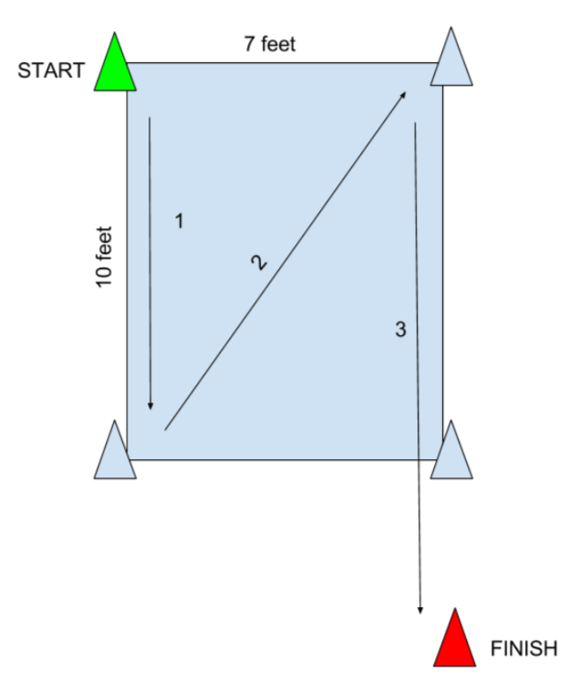
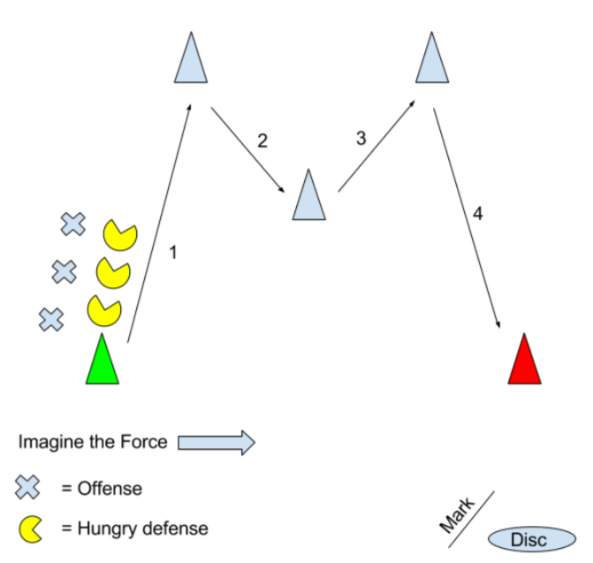
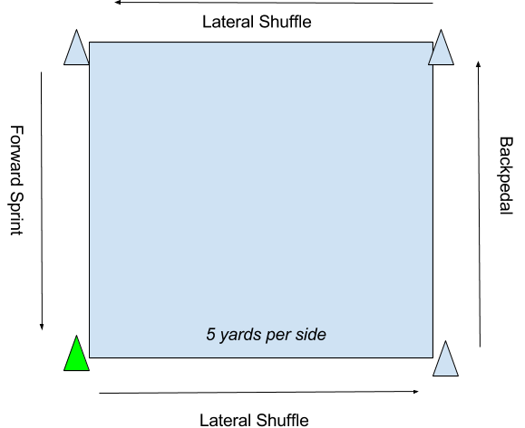

# Defensive Footwork and Positioning (Carolyn Matthews)

# week 1 - Make Your own Agility Ladder and Drills

### Defensive Concepts

- Keep it low, athletic stance
- Lateral/backward movement
- Ground touches, fast feet
- Head up
- Picking your spot (what you’re taking away)

Check out this video to see Surge defending Opi and examples of lateral movement, athletic stance, backpedaling, drop-stepping, straight sprinting, fast feet, constant repositioning and keeping your head up to check in with the disc. 

Note: Opi is in the reset handler position after the first pass.

<iframe src="https://www.youtube.com/embed/8ZRdsbK0eZ8?rel=0" width="560" height="315" frameborder="0" allowfullscreen="allowfullscreen" style="box-sizing: border-box; position: absolute; top: 0px; bottom: 0px; left: 0px; width: 640px; height: 360px; border: 0px; background-color: rgb(0, 0, 0);"></iframe>

###  DIY Ladders

It is not necessary to have ladders to do this exercise. You can space on the ladder with cones or whatever you have around - 11 cones, 18 inches apart. You can purchase agility ladders for sale at sporting goods sports or online OR you can make a set:

**You will need:**

1) Duct Tape: 30 feet.

2) Paint Stirring Sticks: You will need 11 of them. Get the big ones, which are just over 20 inches long. Go to the paint counter at Home Depot: they will give them to you for free.

**Instructions:**

Lay down two rows of duct tape at 15 feet long
Lay out the paint sticks.Spacing is 18 inches. That is, a paint stick at 0", 18", 36", 54", 72", 90", 108", 126", 144", 162", and 180".
Fold over the edges

[Detailed instructions with pictures can be found here](http://www.instructables.com/id/Agility-Ladder-free-and-easy/).

 

### Agility Ladder Drills

Do these drills once or twice a week for the next four weeks. The first time out, focus on learning the movement patterns and don't worry too much about your speed. 

Start with a dynamic warm up. [Here's a warm up you can use](https://www.ultyresults.com/blog/simple-dynamic-warm-up-routine) if you don't currently have one.

Do four-6 repetitions of each drill. Remember, these drills are about increasing your quickness. So be sure to give yourself enough rest between repetitions (at least 15 seconds) so that you can do these drills at your maximum intensity.

**Lateral Two in, two out**

<iframe src="https://www.youtube.com/embed/P1slOtUJBL8?rel=0" width="560" height="315" frameborder="0" allowfullscreen="allowfullscreen" style="box-sizing: border-box; position: absolute; top: 0px; bottom: 0px; left: 0px; width: 640px; height: 360px; border: 0px; background-color: rgb(0, 0, 0);"></iframe>

 

**One in Jab**

<iframe src="https://www.youtube.com/embed/6bJvYF7Iuvc?rel=0" width="560" height="315" frameborder="0" allowfullscreen="allowfullscreen" style="box-sizing: border-box; position: absolute; top: 0px; bottom: 0px; left: 0px; width: 640px; height: 360px; border: 0px; background-color: rgb(0, 0, 0);"></iframe>

 

**Backwards Crossover Jab**

<iframe src="https://www.youtube.com/embed/gZFw3QcQ7Q8?rel=0" width="560" height="315" frameborder="0" allowfullscreen="allowfullscreen" style="box-sizing: border-box; position: absolute; top: 0px; bottom: 0px; left: 0px; width: 640px; height: 360px; border: 0px; background-color: rgb(0, 0, 0);"></iframe>

 

**Backwards Icky Shuffle**

<iframe src="https://www.youtube.com/embed/fJ1tmETAMAw?rel=0" width="560" height="315" frameborder="0" allowfullscreen="allowfullscreen" style="box-sizing: border-box; position: absolute; top: 0px; bottom: 0px; left: 0px; width: 640px; height: 360px; border: 0px; background-color: rgb(0, 0, 0);"></iframe>

 

**Two in Two Out**

<iframe src="https://www.youtube.com/embed/fTUC4qVgA0M?rel=0" width="560" height="315" frameborder="0" allowfullscreen="allowfullscreen" style="box-sizing: border-box; position: absolute; top: 0px; bottom: 0px; left: 0px; width: 640px; height: 360px; border: 0px; background-color: rgb(0, 0, 0);"></iframe>

 

###  Other agility ladder resources

Ren Caldwell - [Great instruction with finer points of agility ladders](http://skydmagazine.com/2016/04/footwork-for-defense-why-what-and-how/)

 Melissa Witmer - [Speed and Agility Training 101](https://www.ultyresults.com/blog/Speed and Agility Training 101) (The science behind the rest/work ratio)

### Reading/Watching for Next Week

[Language in Ultimate: Defensive Positioning](https://ultiworld.com/2016/01/27/language-ultimate-defensive-positioning/) by Kyle Weisbrod 

[Basic Concepts Of Person Defense In 42 Seconds](https://ultiworld.com/2015/03/03/basic-concepts-of-person-defense-in-42-seconds/) by Kyle Weisbrod

*Full disclosure: Matty Farrell is my brother-in-law

[Sandy, Surge, and Understanding Star Defense](https://ultiworld.com/2014/07/30/surge-sandy-studying-elite-defensive-dominance-powered-agility-five-ultimate/), Powered by Agility from Five Ultimate

By Jeff Hetzel, Sean Childers and Jeremy Weiss

 

## Homework

1) Post video of yourself doing agility ladders

2) Post a link to your agility ladder inspiration (i.e. On the beach in boots)

 

# week 2 - Drop Step and W Drills

Today we’ve got guest coach Jesse Shofner with us to explain two effective drills you can use almost every day to help incrementally improve your defense this season.

The purpose of these drills is to get the muscle memory down so in a game the movement is automatic.

To get this muscle memory, it's all about REPS, REPS, REPS.

You can do this drills before every practice OR every morning after coffee and before waffles.

**As always, remember:**

- Keep it low, athletic stance
- Ground touches, fast feet
- Head up
- Picking your spot (decide what you’re taking away) - more on this in the video

## Drill 1: Drop Step Drill 

**The Setup:**

 

<iframe src="https://www.youtube.com/embed/vuWkN160M0c?rel=0" width="560" height="315" frameborder="0" allowfullscreen="allowfullscreen" style="box-sizing: border-box; position: absolute; top: 0px; bottom: 0px; left: 0px; width: 640px; height: 360px; border: 0px; background-color: rgb(0, 0, 0);"></iframe>

**Common Mistakes**

<iframe src="https://www.youtube.com/embed/HArYHD274nU?rel=0" width="560" height="315" frameborder="0" allowfullscreen="allowfullscreen" style="box-sizing: border-box; position: absolute; top: 0px; bottom: 0px; left: 0px; width: 640px; height: 360px; border: 0px; background-color: rgb(0, 0, 0);"></iframe>

**Side view**

<iframe src="https://www.youtube.com/embed/l0iil1CNbT4?rel=0" width="560" height="315" frameborder="0" allowfullscreen="allowfullscreen" style="box-sizing: border-box; position: absolute; top: 0px; bottom: 0px; left: 0px; width: 640px; height: 360px; border: 0px; background-color: rgb(0, 0, 0);"></iframe>

##  Drill 2: W Drill 

**The Setup:**

**W drill**

<iframe src="https://www.youtube.com/embed/ogJ8ruyM5Q4?rel=0" width="560" height="315" frameborder="0" allowfullscreen="allowfullscreen" style="box-sizing: border-box; position: absolute; top: 0px; bottom: 0px; left: 0px; width: 640px; height: 360px; border: 0px; background-color: rgb(0, 0, 0);"></iframe>

**With a partner**

<iframe src="https://www.youtube.com/embed/iGfkIbamOWo?rel=0" width="560" height="315" frameborder="0" allowfullscreen="allowfullscreen" style="box-sizing: border-box; position: absolute; top: 0px; bottom: 0px; left: 0px; width: 640px; height: 360px; border: 0px; background-color: rgb(0, 0, 0);"></iframe>

## Homework:

- Do a minimum of 4 reps of the drop step drill and 4 reps of the W drill twice this week. 
- If possible, keep up the ladder drills you worked on last week and add the drills this week to those sessions.

# week 3 - Square Drill and Diamond Drill

You can do this drill on your own, with a partner or team.

Get warm before doing it with plyos, bands and/or ladders.

A huge part of defense is endurance which is why we’ll do this drill for time. Start with one minute on, one minute off. Do that five times.

This drill works on three key movements:

\- Lateral Shuffling

\- Backpedaling

\- Forward Sprinting

Backpedaling and lateral movement are key to maintaining good defensive positioning - both

allow you to keep your eye on your player and on the disc.

Remember:

\- Stay low

\- Maintain that athletic stance

\- Head up

\- When shuffling, don't pop up or click your heels. Keep your butt low and practice short shuffles.

<iframe src="https://www.youtube.com/embed/n3cozlApsQ4" width="560" height="315" frameborder="0" allowfullscreen="allowfullscreen" style="box-sizing: border-box; position: absolute; top: 0px; bottom: 0px; left: 0px; width: 640px; height: 360px; border: 0px; background-color: rgb(0, 0, 0);"></iframe>

 

Diamond Drill

<iframe src="https://www.youtube.com/embed/8ySIJfUwcbE" width="560" height="315" frameborder="0" allowfullscreen="allowfullscreen" style="box-sizing: border-box; position: absolute; top: 0px; bottom: 0px; left: 0px; width: 640px; height: 360px; border: 0px; background-color: rgb(0, 0, 0);"></iframe>

This is a live disc drill where pairs of O/D start at A. The offense drives to B, and then chooses cone C or D and continues to E. At cone E, the offense gets one move (either continue your deep/under cut or change direction once). Defense chooses a way to dictate at the beginning of the point and focuses continuing that dictation through the cut. As the drill progresses, offense can get two moves, or the cones CDE can be removed.

<iframe src="https://www.youtube.com/embed/VB5VdieR5OE" width="560" height="315" frameborder="0" allowfullscreen="allowfullscreen" style="box-sizing: border-box; position: absolute; top: 0px; bottom: 0px; left: 0px; width: 640px; height: 360px; border: 0px; background-color: rgb(0, 0, 0);"></iframe>

<iframe src="https://www.youtube.com/embed/jhoZx1Df9J4" width="560" height="315" frameborder="0" allowfullscreen="allowfullscreen" style="box-sizing: border-box; position: absolute; top: 0px; bottom: 0px; left: 0px; width: 640px; height: 360px; border: 0px; background-color: rgb(0, 0, 0);"></iframe>

Homework

\1. Watch and comment with observations:

https://ultiworld.com/2014/07/30/surge-sandy-studying-elite-defensive-dominance-powered-agility-five-ultimate/

------

# week 4 - Star Drill

**Star Drill**

This takes us back full circle to that fast feet drill I did at basketball practice.

**You’ll need:**

A Partner

Seven cones

Tennis ball

 

-You’ll start at the center cone and return there after every rep
-Begin by having your partner point to cones (or shout out a number cone)
-You can do for time (60 seconds) or for 5 throws/points

<iframe src="https://www.youtube.com/embed/QcAWoAzvaAY" width="560" height="315" frameborder="0" allowfullscreen="allowfullscreen" style="box-sizing: border-box; position: absolute; top: 0px; bottom: 0px; left: 0px; width: 640px; height: 360px; border: 0px; background-color: rgb(0, 0, 0);"></iframe>

-You can also do this drill by having your partner throw a tennis ball toward a cone adding a hand/eye portion to the drill
   -Note: Focus on catching the ball, not reaching the cone 

<iframe src="https://www.youtube.com/embed/3LQ5pzppEyg" width="560" height="315" frameborder="0" allowfullscreen="allowfullscreen" style="box-sizing: border-box; position: absolute; top: 0px; bottom: 0px; left: 0px; width: 640px; height: 360px; border: 0px; background-color: rgb(0, 0, 0);"></iframe>

-You can then add two numbered cones
   -Note: Figure out your route THEN go

<iframe src="https://www.youtube.com/embed/qgKdy4jwqFQ" width="560" height="315" frameborder="0" allowfullscreen="allowfullscreen" style="box-sizing: border-box; position: absolute; top: 0px; bottom: 0px; left: 0px; width: 640px; height: 360px; border: 0px; background-color: rgb(0, 0, 0);"></iframe>

**Emphasis:**

Reaction

Ground touches, butt low

Efficient with movements - first motion going toward the target

 

**Drill Pros:**

Lots of variations

Mental component when adding two (or three!) numbers

You can choose to focus on your backpedal or cross over step when going backward

 

**Homework:**

View and note which reps Ryan does the most efficient movements

Upload videos of yourself running these reps!