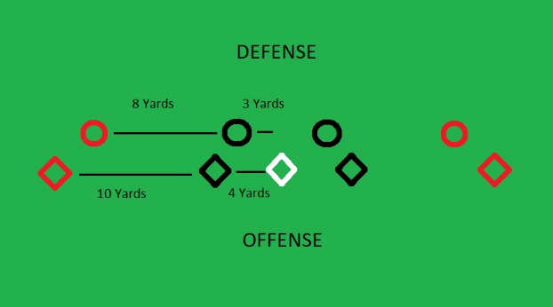

# Cutting (Keith Raynor)

## Week 1- Fundamentals of Cutting
### The Goal of Good Cutting
When we are cutting, what are we trying to accomplish? Are we trying to score? To get the disc? To beat our defender or the defense? It’s obviously not as simple of a question as it seems on the surface. We’ll take one of each, please!

But what I want to focus on is getting separation. This is the basic idea at the center of what we are doing as cutters. If we get separation, we beat the defense. To get the disc effectively, we need to create separation for our thrower to hit us in. If we want to score, we’ll have to getting separation in the end zone. Ultimately, if we are getting separation, attacking the right spaces, and timing it all correctly, we are going to be a very effective cutter.

https://gfycat.com/AnxiousHandyHoatzin

Here, we see a cutter get separation o the break side. Because the mark is so far away, the cutter has the opportunity to put up a break side huck. Throwers are often most dangerous in the first two seconds after they catch the disc. If the cutter’s catch is contested, they won’t have the space from the mark to make a quality throw.

https://gfycat.com/KeyCoordinatedBarnowl

Here, the handler gets separation, allowing them to make a yardage-gaining break throw! That’s about as valuable as it gets! Look at how far the mark gets away from the handler. Think of how many options that handler has a thrower: break side, huck, give and go, etc.

### The Three Variables
There’s three variables we can manipulate when we’re cutting: our speed, our direction, and our position. When we accelerate, we change our speed. When we plant hard and push the other way, we change direction. When we go from open side to break side, we change position, specifically field position. When we get between our defender and the space the thrower is targeting, we change our body position. And in varying combinations, we can create an nearly infinite number of ways to get separation.

For the most part, we are going to focus here on speed and direction. Position is very contextual, in particular field position. It can be hard to practice and gets reps with. It’s hard to build away from the field. But speed and change of direction? We’ll talk some about body position, but mostly focus on those.

### Homework
For homework, we have a partner drill, and one of my favorites: Five Cone Cutting Drill.

The setup above shows nine cones, arranged in two rows. The Offense cones are further apart and have a middle cone. You can play with these distances however you’d like, but you want your far cones 14 yards from the middle and the short cones 4 yards from the middle. The Defense cones are 11 and 3 yards from the middle; you can adjust these as you see fit.

Have your cutter start on the middle cone, marked as white above, and the defender directly across from them, a buffer between them in line with how you coach defenders. The Offense begins by running to one of the short cones. The defense tries to beat the offense to their corresponding short cone. The Offense then runs to their opposite short cone, and again, the defense tries to beat them to their corresponding cone. The Offense then must return to the middle cone.

At this point, the objective is for the offense to reach one of their far cones before the defense can reach the corresponding far cone. This represents getting open deep or under. Again, to reinforce it, the defense’s objective on every change of direction is to beat the offense to the corresponding defensive cone, not beat the offender in general. The reason we focus on this is because, as you recall from the beginning, our goal is getting separation! And this drill focuses specifically on changing speed and direction (since you can’t leave the row of cones) to create separation.

Go through this drill with a partner or group of people and get everyone at least 8 reps.

Once you get it down, you have flexibility to adjust distances, remove the short defensive cones, or add restrictions to how many changes of direction a cutter can make or an amount of time to be counted out loud that the cutter has before they have to commit.

Have questions? Post them below!

## Week 2 - The Cutting Families
In our last session, we looked at three variables we can manipulate as cutters: speed, direction, and positioning. Cuts are combinations of manipulating these elements.

We can divide cuts into three major families: Commitment, Explosion, and Shoulder. Most cuts are either in one of these families, blended together, or are really multiple separate cuts in succession. Commitment cuts rely on a change of direction, typically when your defender has committed to one direction and you change to a different one. Explosion cuts rely on a change of speed. They are often most effective when they timed correctly, either within the flow of the offense, based on the behavior of the defense, or both. Shoulder cuts combine a change of position, getting you to a favorable position and putting your defender in a weaker position.

### Explosion

https://gfycat.com/incrediblelategalah

There happens to have been a very timely article on Ultiworld (note: only fully available to paid subscribers to Ultiworld) entitled “Notes From a Contrarian Coach: Great Cutters Don’t Fake” and it describes, more or less, how effective many cutters are at simply changing speeds at the right time using explosion cuts. Most cuts are explosion cuts. Simply accelerating in one direction is often enough to extend an existing advantage on your defender and get you the separation you need to be successful.

https://gfycat.com/incrediblelategalah

Watch the cutter at the back of the stack. He sees the defender is not looking, the ideal time to make an explosion cut, and accelerates away. Nothing tricky, just timing and speed.

When should we use this cut? Conceptually, when you already have an advantage you want to press. Is your defender not between you and a space you’re threatening, like the deep space? You can explode to extend your advantage. Is your defender not looking at you? Has the disc position changed which spaces you can threaten, like after a swing to the break side? Are you simply faster than you defender? These are all advantages we can build on with explosion cuts.

### Commitment

https://gfycat.com/immensethiskoodoo

The cutter at the front of the stack drives hard towards the right side of the field. As soon as the defender commits to that direction, the cutter changes. Look at their hips! The cutter’s hips are not committed to that direction, but the defender’s hips are facing the right side of the field. The cutter dictated the situation. The idea here is to force your defender to commit to a direction and then change direction.

https://gfycat.com/naiveblanddwarfmongoose

The cutter on the far side of the field turns and drives out with a few hard steps. It forces the defender to commit. When the cutter changes direction, again, look at which way the defender’s hips are facing. They are facing out while the cutter is going in. The defender’s body is committed to out.

### Shoulder

Between Explosion and Commitment cuts, so to speak, are shoulder cuts. They involve a change of direction, like commitment cuts, but are shorter and rely on you to read what the defense gives you more than a commitment cut. By attacking a defender’s shoulders, you can force them to twist their shoulders (and more important, hips!), and that opens up space for you to change direction. A jab step or a few forward steps might be all it takes to create this commitment.

https://gfycat.com/everlastingdamagedfrog

Perhaps we should call this the Shofner Cut because Jesse Shofner has it mastered. Her quickness and decisiveness are elite, and you see how quickly she reads her defenders’ commitment to decide where to attack after her initial jab step.

https://gfycat.com/impartialfondfugu

Look at the cutter in the top right part of the screen, Alissa Soo. While her initial move is strong, the defender does an excellent job recovering. Soo changes direction again as a reaction, and while she gets open, the timing is no longer right to get the disc. But the technique of her cut is on display.

### Homework
For homework, consider the following questions:

What variable of cutting are you most effective at manipulating? Which family of cut are you the best at?
What variable to you utilize the most? Which family do you use the most?
Bonus: If you have a playing opportunity between this week’s module and next, try to use a cut from each family over the course of play, even if it’s uncomfortable. Push yourself past your habits and out of your comfort zone!

## Week 3 - Creating Space
### Dividing Up the Field
If we’re going to take space on the field, let’s make sure we understand the space. How I talk about field space has changed recently. I’ve explored a philosophy from US U24 Mixed National Team coach Martin Aguilera [Link: https://ultfris.blogspot.com/2018/02/defining-space-and-how-we-access-it.html], which looks at how players use the field to identify the varying spaces. In simple, there are three spaces: active, inactive, and ready space. These spaces change as a possession evolves, but each offense has intended active and inactive spaces.

Let’s examine what these terms mean and how we can apply them. “Active” space refers to space our offense intends to use to advance the disc towards our goal of scoring. “Inactive” space refers to, as you can imagine, space we don’t intend to use. “Ready” space is space we may occupy in order to set up our offense, clarify, and clean up these spaces.

For example, a vertical stack might identify the open side as the primary active space, the break side as the inactive space, and the stack itself as the ready space. Those spaces may change as the disc moves or the stack moves.

Now that we have a language to talk about and think about these spaces, we can talk about what to do as cutters with said space.

### Making Space
We talked about manipulating speed and direction to get separation from our defenders. We can also use our positioning to both get separation and generate more benefits for our offense when we do cut. But we are not the only cutter out there. Often, we are cutting in concert with our teammates, and understanding how to work with them is critical to being an effective cutter. Too many cutters simply think about how their actions affect them and their matchup, and not holistically about how their cuts affect their entire offense.

We want to think about how to make space, both for ourselves and teammates.

For ourselves, we might see one of the best deep throwers going up the line, and take a few steps towards the disc, then planting to go deep, giving us more deep space to attack.

For our teammates, the most popular way to make space is to clear! Clearing is a huge part of cutting, and is functionally always a space-making tactic. By clearing, we vacate active space, either for an alternative active space (think going from under to deep) or for ready or inactive space (clearing to the stack).

However, even non-clearing cuts can make space. Maybe you’re isolated out of a side stack, have your defender underneath you, and immediately take off deep. You draw help from the back of the side stack and create underneath space for a teammate. Or in a zone, you make a threatening cut to crash the cup, pull in an extra defender, and make space for a throw over the top to another teammate.

https://gfycat.com/ajarfaithfulcockatoo

Here, a cutter takes off deep on the inside lane, creating offensive momentum there. It draws a defender and creates a big open under space that his teammate can take advantage of.

We have to be conscious about how our actions affect our offense’s opportunities and think of ourselves as part of the cutters rather than individual cutters. Once we start thinking about the field as spaces that we can take and make, we can work together more synergistically!

### Taking Space
Once our teammates make space, it’s time to take space. This means is important to

- Identify active space, including which are more important than others
- Be attentive to your teammates and where the disc is
- Time our movements to capitalize

https://gfycat.com/loathsomedefiantfoal

Not one, but two cutters go from the middle of the field, towards each of the sidelines. There’s a massive empty space in the middle, space given to a teammate, and a cutter comes under into that space. Even though those other two cuts didn’t get the disc, they made space, and this cutter did their job in taking it.

The most common form this takes is something I call “countering”, which is basically a way to describe taking space that a teammate’s offensive movement created by forcing defenders to vacate them. Common examples include a deep cut drawing defenders to make space under (as described above) and an upline dump cut opening up a filling cut from downfield into the backfield (one of my favorite ways to get the disc off the line).

https://gfycat.com/kindlydependentflycatcher

Watch the cutter coming in from the back of the stack. Their teammate takes off deep, draws the under cutter’s defender, and the under cutter patiently waits for the under space to open up. The initial attack (deep) is viable, but the offense counters that movement to take advantage of the space it created. The cutter gets the disc with plenty of separation to work with.

I have found nearly every successful offense I see counters well. They can cascade advantages they earn over the defense until they overwhelm them, as one player gets out of position and then another does the same trying to help the first, and it continues like dominos falling.

### Homework
I love getting virtual reps through film and think it can be easier to see structural functions of offenses through film than actually on the field. With that in mind, this week’s homework is going to involve watching some film. Please refer back to resources in the introduction if you need help finding free footage.

Find two examples of a cutter making space.
Find two examples of a cutter taking space.
For these examples, please note the time in the video that the events occur and post those! Check out what others post to see their perspective.

## Week 4 - Ways to Attack as a Cutter
Mostly, we have talked about cuts in general terms that apply to many situations. While cuts can be grouped into the different Families of Cutting and function based on manipulating the three variables, that’s still covering a lot of ground when we talk about how to get open. There’s something of an art to beautiful cutting, and to me, it’s a pure form of sport, where the body and mind connect to go one on one to best the opposition.

And while I encourage all of you to go out and discover the footwork you like the best, to react to your defense and your teammates, there are also some tried and true options that work within the common constraints of our game. Let’s look at some specific cuts that are popular options.

#### Seven Cut

I actually was looking in Twitter for footage of seven cuts to share with you, and one of the first responses I got was from my pal Cody, who coaches the Cal Poly SLO men’s team. He asked if I was talking about as a handler or a cutter, because terminology here can get confusing.

While the position of this cut changes whether you’re in the backfield or downfield, the fundamental principles are the same: make a hard cut angled towards a sideline, then hit a 45-degree turn back towards the opposite sideline.

As a cutter:

https://www.loom.com/share/475b6da4f8b6406abe83f4248f1e7b8a

As a handler:

https://www.loom.com/share/e551ece19b9d46a987c8fb65b5d37a8b

By attacking a position and driving the defense to overcommit to it--defending the upline in the handler seven and stopping the undefended break side in the cutter seven--the cutter can then shift the angle of attack to a different position on the field and take advantage of their defender’s overcommitment. Quick, what variables are we manipulating? (Can we footnote: I’d say direction and positioning.)

As a cutter:

https://gfycat.com/generousmeagerkomododragon

As a handler:

https://gfycat.com/meekpopularabyssiniancat

It can be deadly.

#### Curl Cut

The curl cut seems to have become much more popular over the last few years. It can be a little tough to describe, but you frequently see it when a player gets downfield from the disc, starts to move towards the backfield, like they are going to get a reset behind the disc, and then they curl right under their defender back to open side downfield. This cut is won by the offender when they can create a moment where they are accelerating away from the defender, but the defender can’t accelerate in the same direction because they are committed to going behind the disc and because the cutter is in the space they would use to accelerate. This is a great shoulder cut for getting upline action.

https://gfycat.com/jampackedacclaimedamericanwarmblood

https://gfycat.com/heartfeltadvancedbee

It takes some footwork practice to smoothly be able to convert the backfield cut into the upfield cut with enough pace to beat the defender to the space, so this is one I recommend getting reps with. Try to keep your center of gravity above your base (don’t lean your body or extend your legs too far in a given direction) as you move towards the backfield to increase how quickly you can curl!

#### Stutter Step

This is a personal favorite of mine, particularly because I’m not someone with the explosive athleticism to blast away for the defense. I like this cut because, simply but manipulating your speed, you can fool the defender into thinking you’re changing direction. And being sneaky is fun!

The simplest explanation of this move is to start charging in a direction, slow down as if you’re about to change direction, and then push back in the same direction. A lot of times, you might actually take a small jump or kick a leg out as if you’re going to plant to change direction. In football and basketball, you probably would know this as a “Hesitation” move, which it also might be in soccer.

Here it is in football:

https://gfycat.com/sanedeadhypacrosaurus-penn-state-nittany-lions-fightonstate-com

And here it is in basketball:

https://gfycat.com/wearylawfularrowana

Even though these examples are from outside of ultimate, the are operating on the same idea: creating the threat that you will change direction in order to create room to pass by the defense. In the basketball example, you can see the defender’s body react to the hesitation by raising up to prepare to change direction. The offensive player might move backwards or bring the ball to their right hand to go the other direction, but just that brief pause gives them time to pass by the defense.

### Homework
I’ll be honest: I don’t really know the name of this drill. I learned it from David Allison, who at the time, was coaching the University of Virginia’s (UVA) women’s team, so I called it “UVA Drill”. One of my fellow coaches called it “Ambler Drill”, after Gwen Ambler. But let’s try a less referential name that describes the drill: “Clear Cut Drill”.

https://gfycat.com/uncomfortablefatalamoeba

You need a cutter, defender, and a thrower. Then you need a starting point, a “clear lane”, and an activation cone. Your cutter makes a cut, doesn’t get open, and clears to the space between the two “clear lane cones” and the sideline. They should jog in this space, pushing downfield to simulate clearing and pushing after a completion to a teammate. They can exit this space at any time, go into the area of the activation cone (they don’t necessarily need to touch it, just be near it), and then then they are live to cut out or in.

Side note: You may want your thrower to actually throw a dish to another thrower to move the disc forward and reset the stall count. You can simulate this by having the thrower throw a short throw to themselves.

I use this as a defensive footwork drill, but most person defense drills and cutting drills work in reverse. This is a great drill for setting up a game-like situation for a cutter and defender, and helping teach cutters about how much clearing is part of cutting, and transitioning from one to the other. This is a great chance to test out moves like the ones in this Module! Go forth and try it out!
