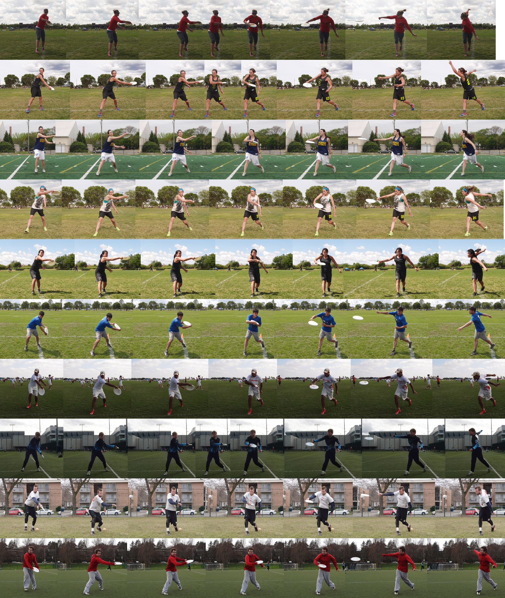
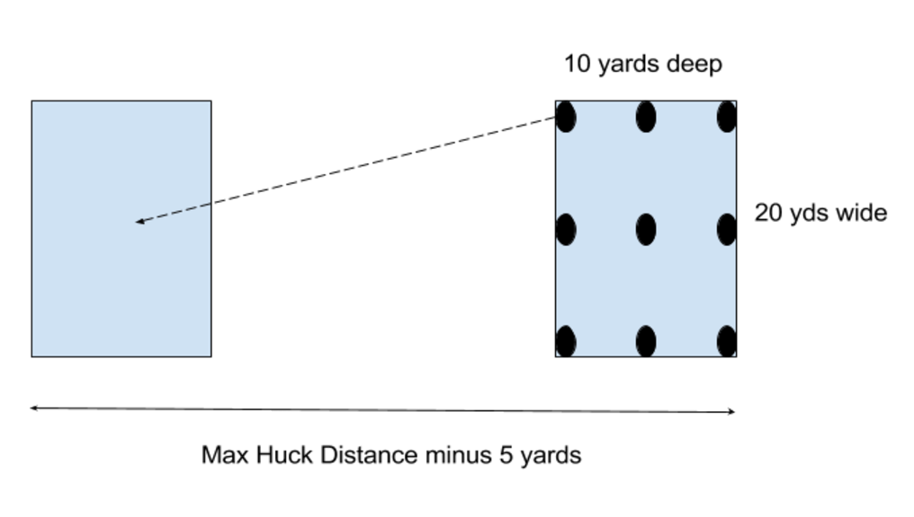
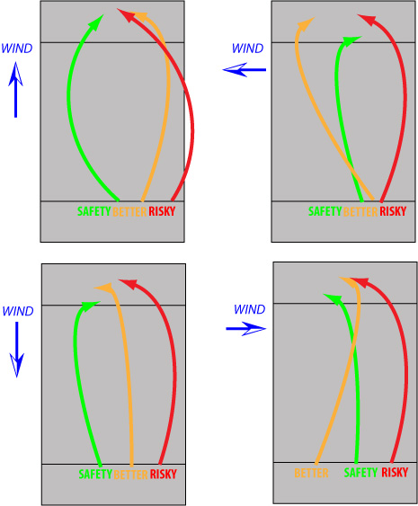

# Backhand Hucks and Pulls (Colin McIntyre)

### Video might be more useful for this chapter, mainly for weeks 1 and 2

# week 1 - Filming, Assessment, and The Pulling Game

## HW #1 - Film Yourself and do a baseline assessment.

### Things you'll need:

- A video camera or smartphone
- A tripod or a friend
- 5-10 discs (best if they're relatively new and not beat up)

## Part 1: Filming Yourself

Here's the ideal setup:

**Hucks:**

- 2 from side,
- 2 from front (huck over camera),
- one 15-20 yard throw.

**Pulls:**

- 2 from front,
- 2 from side, noting the shape

## Part 2: Baseline assessment

### **Hucking Alley**

Huck 10 discs into 20 yd wide “alley.” Measure how many land in the target area and how far they go. Note any wind. Ideally throw without wind or throw downwind.

- Record the distance of each throw
- Record whether it landed in or out of the alley
- Record the number of throws that landed in the alley
- Record the distance of your longest throw that landed in the alley

*See video for more in depth instructions*

*See the pdf on this page to download, print, and record your results.*

 

### **Pulling Game**

Warmup 3 IO, 3 flat, 3 OI.

- 3 OI left, center, right
- 3 Flat left, center, right 
- 3 IO left, center, right

**Scoring**:

-  1 point for a pull that lands in bounds
- 1 point for the correct shape of pull (IO, Flat, or IO) (do not award any points if the pull is out of bounds)
- 1 point for a pull that lands in the target third
- 1 point for the pull landing in the endzone

Zero points for any pull that lands out of bounds. Max 4 points per pull for a max total score of 36 points.

*See video for more in depth instructions*

*See the pdf on this page to download, print, and record your results.*

 

**[Submit Your Homework Using This Form](https://docs.google.com/forms/d/e/1FAIpQLSfiqfajIJnZzUswvm60ywWWaxPfHgxFzOG41zVAOrulTvxzog/viewform?usp=sf_link)**

Note: Keep track of your own results for your own reference in the pdf file, in the comments below, or somewhere else for yourself. The form is for us to know how well our program is working at improving your hucking and pulling results over the next four weeks. We'll also let you know the distance of the longest hucks and pulls from the group!

**Have questions?** Ask in the comments below and we'll help you asap!

# week 2 - Comparing Throws and Hucking Drills

This week’s assignment is about working on the necessary components of a powerful backhand, and comparing one’s own footage against some established powerful throwers.

Throwers should plan to:

- Confirm comfortable wrist action.
- Double-check upright body position.
- Work on step and weight transfer to front foot.
- Add shoulder and hip turn and arm pull-through.
- Increase shoulder turn and hip action for more distance.
- Review the provided photo and video of powerful throwers.

 

If you can, freeze frame your own throwing footage and see how your body positioning does or does not match with the elite throwers at the same positions.

 *Download this image on the right hand side of this page if you like!*

### Hi def slow motion footage of throwers in action:

<iframe src="https://www.youtube.com/embed/4AEKvlLG86Q?rel=0" width="560" height="315" frameborder="0" allowfullscreen="allowfullscreen" style="box-sizing: border-box; position: absolute; top: 0px; bottom: 0px; left: 0px; width: 640px; height: 360px; border: 0px; background-color: rgb(0, 0, 0);"></iframe>

 

 

## Drill #1: Progressive Distance Drill

Warm up and throw through a progression and different distances, adding power sources as the distance increases. Throw from an upright position, as described in the in the intro video. No wide or low pivots. Throw 10-20 throws per distance, and advance as you get more comfortable with each level of power. Adjust distances as necessary to accommodate your progress.

1. Begin throwing 10-15 yards using wrist and elbow, with minor weight shift.
2. Back up to 20-25 yards, and add a step and weight transfer.
3. Back up to 35-50 yards and add a relaxed shoulder and hip turn.
4. Back up to maximum distance and use maximum shoulder turn and pull-through.

### See Colin's Demo:

<iframe src="https://www.youtube.com/embed/QEzz_62Zri4?rel=0" width="560" height="315" frameborder="0" allowfullscreen="allowfullscreen" style="box-sizing: border-box; position: absolute; top: 0px; bottom: 0px; left: 0px; width: 640px; height: 360px; border: 0px; background-color: rgb(0, 0, 0);"></iframe>

 

## Drill #2: Shoulder turn and hip coordination

<iframe src="https://www.youtube.com/embed/cv7AC-O-KSE?rel=0" width="560" height="315" frameborder="0" allowfullscreen="allowfullscreen" style="box-sizing: border-box; position: absolute; top: 0px; bottom: 0px; left: 0px; width: 640px; height: 360px; border: 0px; background-color: rgb(0, 0, 0);"></iframe>

- The idea of this drill is to help throwers feel the connection between hips and shoulders.
- Wind up the shoulders with a big shoulder turn and reach-back.
- Have a partner grab your arm and pull gently to provide some tension.
- Step with the non-pivot foot, and gradually shift weight into the foot and turn the hips slightly.
- Feel the slight stretch in your lats and upper back and the hip movement begins to pull the shoulders around.
- This slight stretch should exist in the normal throwing motion, and it is an indication that your timing is right.
- The weight transfer and hip rotation should begin just barely before the shoulders turn and arm pulls through.
- You can hold a theraband with tension on it (from partner or tie other end stretched tightly, wind up the shoulders, and then make a full unwind and pull-through (without a throw).
- If you find yourself pulling early with your arm, work on the hips and weight transfer happening first..

 

## Drill #3: Box Hucking Drill

You'll need: 9 discs and two boxes 20 yards wide and 10 yards deep.

1. Throw a huck maximum distance. Set up the boxes so that the distance between the back of the two boxes is five yards less than the max huck distance.
2. Set up three rows of disc across the box, on the front line, through the center, and along the back line.
3. There should be a disc at each corner, a disc in the center of the box, and a disc on the middle of each side of the box.
4. Huck the discs from one box to the other. Pause to watch your throw, and then promptly move to the next disc. Note how many discs landed in the box, and then reset the discs and huck back in the other direction. Throw a total of 36 hucks; 4 times through the drill.

Tip: Don’t think too much. Aim for the box and use one coaching cue for yourself (e.g., turn your shoulders).

 

Record how many hucks landed in the box on each of your four sets. 

**[Submit your homework in this Google form!](https://docs.google.com/forms/d/e/1FAIpQLSc9vhVcVnrixwAnXC0XLMENAELmmDz-toPS8ubg9fl_Tdo5nQ/viewform?usp=sf_link)**

Questions about this homework, use the comments below!

# week 3 - Pulling

## Pointers from Last Week

Last week covered a lot of information regarding backhand form and generating power, which will be valuable for you to continue to review as you work on your own form.

<iframe src="https://www.youtube.com/embed/y6wwqJM7HhY" width="560" height="315" frameborder="0" allowfullscreen="allowfullscreen" style="box-sizing: border-box; position: absolute; top: 0px; bottom: 0px; left: 0px; width: 640px; height: 360px; border: 0px; background-color: rgb(0, 0, 0);"></iframe>

The compilation photo of different throwers shows great similarity and various positions in the throwing motion, but you can also identify differences from player to player (e.g., height of disc at reach-back, position on follow-through, etc). As you continue to work on your form and review your footage and compare to other throwers, keep a few of these key elements in mind:

- To improve spin and reduce wobble, note that each of the example throwers sets the grip with the off hand. Knowing you have a secure grip when you wind up means one less thing to think about.
- Notice the large shoulder turn, and compare to your own.
- Notice the step slightly forward and weight transfer in many examples, with a strong front leg (straight or slightly bent, and firm) that does not bend to absorb energy or sink into the throw. One certainly can step in other ways and complete a long throw, but this slightly forward step is a good neutral starting position.  
- Pull-through consistently has the arm bent as opposed to swinging around like a pendulum. Bend the arm and let it pull through relatively close to the body. Get a feel for that power, and feel as you load up the wrist and forearm..
- Release point and body position. Notice the upright position of the throwers at release, and compare to your own position. You’ll notice a few of the throwers are tipped a little more forward and are throwing a lower trajectory, but there’s no crouching or excessive leaning.

## The concepts for this week

This week, we’re working on the shape, height, and trajectory of throws, and I’m also introducing the pulling footwork. I have a few introductory comments about the flight characteristics of a disc and what factors contribute to the shape of the throw. The better you understand how the disc flies and how your release angle and power/velocity level affect it, the better you can predict and control the disc’s flight.

<iframe src="https://www.youtube.com/embed/FpP9QjZxTEU" width="560" height="315" frameborder="0" allowfullscreen="allowfullscreen" style="box-sizing: border-box; position: absolute; top: 0px; bottom: 0px; left: 0px; width: 640px; height: 360px; border: 0px; background-color: rgb(0, 0, 0);"></iframe>

For throwing with different shapes and different heights, I like to try to keep my basic motion the same and make adjustments to my posture and body position to support the shape and height that I want. In short, I bend at the waist slightly toward my toes to throw an inside-out angle, and to throw an outside-in I will be more upright. For a higher or lower throw, think about how your hips and shoulders are aligned in relation to your desired trajectory. For a higher throw, your rear hip and rear shoulder will be lower than the front hip and shoulder, which in turn will pull your arm through on that upward trajectory.

<iframe src="https://www.youtube.com/embed/-oyDeUwokpU" width="560" height="315" frameborder="0" allowfullscreen="allowfullscreen" style="box-sizing: border-box; position: absolute; top: 0px; bottom: 0px; left: 0px; width: 640px; height: 360px; border: 0px; background-color: rgb(0, 0, 0);"></iframe>

This week’s homework is probably best broken into two sessions; For the shape session, you’ll be doing the box hucking drill again, and for the second session, you’ll be working on pulling footwork.

## Homework, part 1:  Throwing shapes

Assignment #1 involves throwing specific shapes in the box hucking drill from week #2. Remember to adjust your body position to support the angle you are trying to throw, and fine-tune the angle of your throw and the speed of the throw to really control the flight path. The video description below is a little slow-paced, but also provides some useful content. Remember, if your arm begins fatiguing while you are working on hucking form, that means it’s time to end the session.

<iframe src="https://www.youtube.com/embed/34nmhqPv2RE" width="560" height="315" frameborder="0" allowfullscreen="allowfullscreen" style="box-sizing: border-box; position: absolute; top: 0px; bottom: 0px; left: 0px; width: 640px; height: 360px; border: 0px; background-color: rgb(0, 0, 0);"></iframe>

Box Hucking Drill with different shapes, 4 reps of 9 throws, up to 2 sets

- 1st rep: Steep inside out for left row, flat for center, steep outside in for right row
- 2nd rep: Steep inside out for left row, flat for center, gentle inside out for right row.
- 3rd rep: Steep outside-in for right row, flat for center, gentle outside in for left row.
- 4th rep: Gentle outside in for right row, flat for center, gentle inside out for left row.

Perform up to 2 sets for a total of 72 throws. If doing fewer than the full 2 sets, eliminate the second time through Rep #1, definitely repeat Rep #4, and choose which of Reps #2 and #3 you want to do.

## Homework, part 2: Pulling Footwork

The challenge with pulling and footwork is adding some momentum and using that approach in a way that adds power to the motion. It is not simply a running backhand, and the more momentum you have, the more difficult it is to control that momentum in a way that benefits the throw. Therefore, I’m presenting a footwork progression to help you add a bit of momentum piece by piece, and build your way up to a controlled cross-step approach. As you go through this practice, take a rep or two without a disc, and then add a disc and throw it. If you are having trouble mid-session, feel free to take a minute, think about the steps, and do a couple reps without a disc to get the feel of it. Ideally, the pulling footwork gives you a controlled way of adding a dynamic approach to the backhand, loading up the hips/shoulders/torso a bit more, and transferring that extra energy into the throw.

<iframe src="https://www.youtube.com/embed/DGosbeV8jCA" width="560" height="315" frameborder="0" allowfullscreen="allowfullscreen" style="box-sizing: border-box; position: absolute; top: 0px; bottom: 0px; left: 0px; width: 640px; height: 360px; border: 0px; background-color: rgb(0, 0, 0);"></iframe>

<iframe src="https://www.youtube.com/embed/6i6_VX13yIk" width="560" height="315" frameborder="0" allowfullscreen="allowfullscreen" style="box-sizing: border-box; position: absolute; top: 0px; bottom: 0px; left: 0px; width: 640px; height: 360px; border: 0px; background-color: rgb(0, 0, 0);"></iframe>

Cross Step Progression Practice. 3-5 throws per stage, twice through. Aim to throw at the height of a high huck, start with a gentle inside-out angle, with a goal of a relatively flat high throw. We’ll talk about optimizing height and shape next week.

1. Step and throw. Wind up and step aggressively into the throw, and don’t worry about your pivot at all.
2. Power Position (Right-handed instructions). Step forward with your left foot (typically your pivot) then step with the right foot and throw. Imagine this simulating a slight power position throw.
3. Little Cross Step. Step with the right foot, turn sideways and hop a little with the left foot, and finish with the right step and throw. This little hop does not have to be a full step behind, it is just to get a feel for the little dynamic move.
4. Full Cross Step. This is the full basic motion. Step with the right foot, hop a little, turn your hips and step your left foot forward and behind the right foot, reach back with the arm and shoulders, and make the final step with the right foot for the throw.
5. Walk into the full cross step. I call these “rhythm steps.” Take a couple steps and get your approach ready, so out of your walk, you will break into the cross step footwork.
6. Bouncy rhythm steps into full cross step. You can add some bounce to your rhythm steps to make them more of a jog, which lets you transition to a faster or slower approach into the cross step.

For comparison to some additional throwers, check out some of the videos that Chuck Cleary put together of different pullers at Nationals:

<iframe src="https://www.youtube.com/embed/95g4najJRjo" width="560" height="315" frameborder="0" allowfullscreen="allowfullscreen" style="box-sizing: border-box; position: absolute; top: 0px; bottom: 0px; left: 0px; width: 640px; height: 360px; border: 0px; background-color: rgb(0, 0, 0);"></iframe>

<iframe src="https://www.youtube.com/embed/XLn-jpAGWGw" width="560" height="315" frameborder="0" allowfullscreen="allowfullscreen" style="box-sizing: border-box; position: absolute; top: 0px; bottom: 0px; left: 0px; width: 640px; height: 360px; border: 0px; background-color: rgb(0, 0, 0);"></iframe>

## Written Homework!

Write in the comments 2-3 sentences about what you have learned comparing your own footage to the example powerful throwers. Also note anything that you’re struggling with. This is a good exercise in thinking about form and considering possible adjustments, and it’s helpful to me to see how you’re using the footage. Finally, please let me know how the cross-step work is coming, and I can see if there’s extra help I can offer.

# week 4 - Pulling Strategy

Week four is upon us, and we continue with pulling. This week with a focus on strategy. We have worked on building up the technique for a powerful backhand, have added the footwork for pulling, and have talked about the flight of the disc and how to control the shape of that flight. This week’s strategy discussion the pulling context naturally layers on top of last week’s discussion of the disc’s flight characteristics and the shape of a throw.

 

This week’s homework assignments will include:

- New pulling game
- Re-do the Week 1 assessment, hucking down the 20 yard wide alley game and repeating the initial pulling game.
- Optional/Encouraged: film your throws again.

As we wind down this module, I encourage you to continue with this process of learning the backhand technique. It is a complex body motion, and one really cannot expect to master it in a couple of sessions. Imagine trying to learn a golf swing from a 3 minute youtube video; not going to happen.

I am hoping that the resources and the breakdowns provided here will help you get started on the right track to continue developing your technique, step by step with an end goal of a more powerful, more consistent backhand and pull. Take your time, refer back to the provided examples, and keep filming yourself to assess and track your progress!

Feel free to modify the box hucking drill and the pulling game to suit your needs. As I mention in the video, if you are not consistently able to pull into the end zone, move 5, 10, 15, or 20 yards closer for the pulling game. This modification will let you bring the bonus “in the end zone” point into play, and think more about balancing distance versus height and hang time.

## Pulling Technique - Shape and Distance

<iframe src="https://www.youtube.com/embed/OO9SBaSvkag?rel=0" width="560" height="315" frameborder="0" allowfullscreen="allowfullscreen" style="box-sizing: border-box; position: absolute; top: 0px; bottom: 0px; left: 0px; width: 640px; height: 360px; border: 0px; background-color: rgb(0, 0, 0);"></iframe>

Pulling well involves balancing goals related to distance, height and hang time, and control, where increasing one often decreases another. Throwing at maximum effort for maximum distance makes it harder to control the throw. Throwing for maximum height and hang time reduces the distance on the throw, and a disc thrown really high has a lot of time and space to drift right or left and out of bounds before it comes down.

For distance and hang time, the sweet spot falls somewhere between a line-drive and a disc that flies so high that it falls back toward you. Use these outer limits as guidelines for making adjustments. If the disc has a lot of horizontal speed when it hits the ground (like a line drive), then throw higher to get more distance and also more hang time. If the disc is flying so high that it comes back toward you, throw lower to get more distance and a flight that may stay in the air longer as it continues traveling forward.

To control your pull, it is crucial that you know the shape of the flight and how the disc will finish its flight. Will the disc fall left-to-right, or will it fall right-to-left? The techniques introduced last week will help you control this shape, adjusting the angle of the throw and the speed of the throw to achieve the desired shape. If you want the disc to turn over and fly outside-in, you can throw harder or adjust the angle to be less inside-out. If you want the disc to hold an inside-out path, a steeper angle or a slower throw will help. A steep angle will provide a more reliable, predictable flight, but a gentler, flatter angle will provide more distance and hang time. Also remember, throwing into a headwind is like throwing faster (disc tends to turn outside-in), while throwing with a tailwind tends to cause the disc to fade inside-out as it slows down.

 

## Pulling Strategy

<iframe src="https://www.youtube.com/embed/hnKc3anAH-U?rel=0" width="560" height="315" frameborder="0" allowfullscreen="allowfullscreen" style="box-sizing: border-box; position: absolute; top: 0px; bottom: 0px; left: 0px; width: 640px; height: 360px; border: 0px; background-color: rgb(0, 0, 0);"></iframe>

Strategy and preparation are what distinguish a good puller from someone who simply throws a disc far. A few major considerations as part of pulling strategy include:

 

### Finish

Is this disc going to fall to the left or the right at the end of the flight, and is it going to glide or is it going to knife steeply to the ground?

 

### Aim and Setup

Once you know how the disc will finish, adjust your aim to leave a large landing area, increasing your margin for error. If the disc will finish left, you can aim up the right side of the field, for example.

 

### Entire Flight

Understand the entire flight of the disc, from release until it hits the ground. What will the starting angle of the disc be, and how will that angle change, and how does that affect the flight? How will the speed of the disc affect the flight? What is the wind like, and how will the wind impact the flight and different stages of the flight?

 

### Wind

Make sure to know what the wind is doing. Is it steady? Is it different at different parts of the field, or is it different higher up than at ground level? Is there a crosswind or a headwind/tailwind, or some combination? How does a crosswind affect the flight, and what will the headwind/tailwind do to the flight? Once you have assessed the wind, make a plan for how you will aim the pull, and understand how any crosswind component will affect it and how any headwind/tailwind component will affect it. Given a pure crosswind or pure headwind/tailwind, if your aim is diagonal across the field, your throw will experience a crosswind component and a headwind/tailwind component.

 

### Pull Selection

In any given situation, you probably have several choices of pull in terms of aim and shape. If you have assessed the wind conditions and considered what the entire flight of your different pull options will look like, you can identify the risk associated with different pulls. I like to envision a few different options:

Safety Pull. This is a pull that I know I can execute in the conditions, and I know exactly what it will do. For example, in calm conditions, I can throw a big outside-in pull, and I know for sure it will hold the outside-in shape and come down in the field. Into a headwind, a safety pull might involve having the disc intentionally turn over outside-in, so you can reliably predict its finish and aim accordingly.

Better Pull. This is a pull that will offer a little extra distance or hang time, but may involve slightly higher risk of loss of control. In calm conditions or if you are feeling confident, this is probably your go-to pull. In calm conditions, this would be a big gentle inside-out pull for me; there is some risk that I accidentally turn it over out of bounds or that it glides out of bounds to the left, but I am pretty confident I can get good height, good distance, and land it in the field. In windy conditions, the better pull will likely involve trying to take advantage of the wind or fight longer into the wind, with risk of a slightly less predictable finish.

High Risk, High Reward. This is a pull that will give your team a great benefit if you execute it right, but risks throwing out of bounds. For example, in calm conditions, the S-curve pull could be high-risk, high-reward, as it offers extra hang time and distance, but it introduces uncertainty as to how the disc will finish and requires more precise control. In downwind conditions, aiming to land the disc in the back 5 yards of the end zone would be an example of high risk, high reward, where the risk of the wind carrying the pull out the back of the end zone is fairly significant.

My goal is to throw the “Better Pull” in most circumstances, but I try to recognize when the conditions demand that I throw a safety pull, or opportunities where a higher risk pull might be worth it.

 

The Pulling Game variations provide an opportunity to experiment with different pull shapes and targets and help develop a sense of when certain pulls are higher or lower risk, and how they fit in the Safety-Better-High Risk spectrum. In addition, the chart below describes some options in different wind conditions, pointing out the risk and benefit of each option.

 

## Homework

This week’s homework is best done in two separate sessions.

 

### I) New Pulling Game

<iframe src="https://www.youtube.com/embed/iXLHmOuS71g?rel=0" width="560" height="315" frameborder="0" allowfullscreen="allowfullscreen" style="box-sizing: border-box; position: absolute; top: 0px; bottom: 0px; left: 0px; width: 640px; height: 360px; border: 0px; background-color: rgb(0, 0, 0);"></iframe>

This challenge focuses on trying different shapes of pulls, while placing less emphasis on exact placement. The scoring awards 2 points for in-bounds, 1 point for in the end zone, and 1 point for the correct shape. If you struggle to pull to the end zone, feel free to move up 5, 10, 15 or 20 yards closer (e.g., pull from brick mark) so that you can reach the end zone and take advantage of the bonus point (and balancing distance versus height and control).

There are a total of 72 pulls in this session. 12 warmup pulls, and then 30 pulls in each direction. If your arm tires out early, you can stop. Throwing at 110% max power will likely tire out your arm. Practice relaxing, loosening up, and throwing at 95% power, rather than absolute maximum effort, focusing on a fast, relaxed, powerful motion. The session will include throwing six different types of pulls, five reps of each, once in each direction. The twelve pull warmup is just throwing one of each type and then repeating in the other direction.

1) Big steep inside-out (hard inside-out angle, starts right, cuts left).

2) Big Gentle inside-out (I-O, flattens and glides, then falls left)

3) Big Gentle outside-in (high and flatter, starts left, glides a little and falls right)

4) Flat & Floaty. (starts high and gently IO, flattens and falls more or less flat).  I go for a big shoulder turn/reaching back, and throw at slightly reduced speed to help avoid turning it over outside-in.

5) S-Curve (starts high and gently O-I, cruises left-to-right, and then settles and falls a little right-to-left at the end).  Lots of spin, not a ton of speed or angle, and make sure to throw high enough that the disc has time to S-curve as it falls.

6) Big blade (flies high, comes in hard/blady)

 

### II) Repeat Week 1 assessment

Repeat the baseline assessment from Week !, which is hucking the 10 discs down the 20-yard wide alley, and then the 9-disc pulling game.

If you have time, also consider filming your hucks again, to see if you’ve made any adjustments to form.

[Downloadable pdf and more in depth instructions are in the Week 1 post here](https://www.ultyresults.com/products/skills-development-lab/categories/310996/posts/966262).

 

## Submit Your Homework!

**[Fill out this form with the results of your second assessment](https://docs.google.com/forms/d/e/1FAIpQLSfbPGgUWuYhCumPaD2OhBdZfYflaEg1qKuG6sldLWJ7KhlhIg/viewform?usp=sf_link)**.

We'd love to see if you've improved (or not) versus week 1. Thanks!

# Bonus: Backhand Trouble Shooting

I watched through many of the videos you all posted from earlier weeks, and I have been working with some throwers locally, and I wanted to take a minute to address some common issues I saw. Hopefully this helps with your self-assessments as you compare your footage to some of the examples we've looked at this month. Many of these relate to the key components identified in the first three weeks, so returning to that content may be valuable.

**Symptom:** **Trouble throwing inside-out**; disc tends to fly flat and turn over outside-in.

**Possible Solution:** Check grip alignment. Make sure thumb is not too far ahead of fingers, make sure wrist can move freely with disc in line with forearm.

**Symptom:** **Insecure or unreliable grip on the disc, wobbly throws**.

**Possible Solution:** Use off hand to help set grip, and cock wrist back before winding up.

**Symptom:** **Lack power**, throwing harder is not adding much distance.

**Possible Solution:** check if you are getting a full shoulder turn, compared to example throwers.

**Symptom:** **Inconsistency** controlling height, shape, or direction.

**Possible Solution:** Check your reach-back and see if you are bringing the disc back exceptionally high or otherwise off the line of the intended trajectory of the throw. Minor variation is perfectly acceptable, but major variation made lead to inconsistency.

**Symptom:** **Lack of power**, upper body not in sync with lower body, arm swing on release and follow through is inconsistent.

**Possible Solution:** Check the positioning of your step compared to example throwers. A small step mostly in line with your hips, but slightly forward is the target. A very large step makes it harder to transfer weight and rotate hips. Stepping straight downfield makes it hard to wind up the hips and time them with the shoulders. Stepping straight across or slightly backward restricts hip and shoulder rotation, reduces weight transfer into the throw, and makes it harder to stay balanced.

 

Any particular issues you're having trouble with? Leave them in the comments below!

# Bonus: Pulling Game Variations

### I) Pulling Game #2 (from Homework #4)

This challenge focuses on trying different shapes of pulls, while placing less emphasis on exact placement. The scoring awards 2 points for in-bounds, 1 point for in the end zone, and 1 point for the correct shape. If you struggle to pull to the end zone, feel free to move up 5, 10, 15 or 20 yards closer (e.g., pull from brick mark) so that you can reach the end zone and take advantage of the bonus point (and balancing distance versus height and control).

There are a total of 72 pulls in this session. 12 warmup pulls, and then 30 pulls in each direction. If your arm tires out early, you can stop. Throwing at 110% max power will likely tire out your arm. Practice relaxing, loosening up, and throwing at 95% power, rather than absolute maximum effort, focusing on a fast, relaxed, powerful motion. The session will include throwing six different types of pulls, five reps of each, once in each direction. The twelve pull warmup is just throwing one of each type and then repeating in the other direction.

1) Big steep inside-out (hard inside-out angle, starts right, cuts left).

2) Big Gentle inside-out (I-O, flattens and glides, then falls left)

3) Big Gentle outside-in (high and flatter, starts left, glides a little and falls right)

4) Flat & Floaty. (starts high and gently IO, flattens and falls more or less flat).  I go for a big shoulder turn/reaching back, and throw at slightly reduced speed to help avoid turning it over outside-in.

5) S-Curve (starts high and gently O-I, cruises left-to-right, and then settles and falls a little right-to-left at the end).  Lots of spin, not a ton of speed or angle, and make sure to throw high enough that the disc has time to S-curve as it falls.

6) Big blade (flies high, comes in hard/blady)

 

### Pulling Challenge #3

Week 3 of the pulling challenge.  Last week focused on going through the range of pulls.  This week is about placement, and we're cutting down the reps to 40 pulls (5 pulls for each, then switch directions).  Setup is a field, and mark the target width (EZ + a little in front) at 10-yard intervals across the 40 yards.

 

1) Outside-in, landing in the left side of the field.  2 pts for in-bounds, 1 point for left side of field, 1 point for in EZ.

2) Inside-out, landing in the right side of the field.  2 points for in-bounds, 1 point for right side, 1 point for in EZ.

3) Flat(ish), down the middle.  Land in center 20 yds.  2 points for in-bounds, 1 point for middle, 1 point for in EZ.

4) Call your shot.  For each one, choose a 20 yd landing area, call your shape, and throw.

 

For all of these, it's on us to make sure we're still throwing a good pull (good height, hang time, etc.).  It's easy to score more points by throwing a lower line-drive type of pull that lands in the end zone, but that's not what the challenge is about.  Your choice on how steep of an angle you take on the outside-in and inside-out this week.  

###  Pulling Challenge #4

 This week's challenge is about consistency. 30 pulls, and we're aiming middle 20 yards on all of them.  5 pulls for each shape, go through the three shapes, then switch directions.

 

1) Inside-out

2) Flat

3) Call your shot (can choose a different 20 yd target)

 

3 points for in-bounds, 1 point for target area, 1 point for in the end zone. 5 bonus points for all in-bounds AND either all in the target area or all in the end zone. So 30 possible points per shape, 180 possible points total.